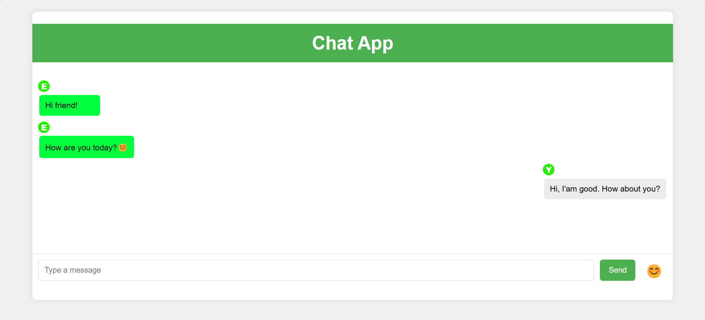

# 🚀 Simple Chat App


Simple chat app using socket.io and React

## 📜 List of Contents

- [Demo](#-demo)
- [Feature](#-feature)
- [Installation](#-installation)
- [Usages](#-usages)
- [License](#-license)
- [Contact](#-contact)

---

## 🎥 Demo



---

## ✨ Feature

✅ Add Custom Username 
✅ Group Chatting 

---

## 🔧 Installation

1. Clone repositori:
   ```sh
   git clone https://github.com/Ester-coder/chat-app.git
   cd chat-app
   ```

2. Install Dependency
   ```sh
   npm install
   ```

## 💡 Usages
1. Run App
   - run server
   ```sh
   cd server
   node index.js
   ```
   - run app
   ```sh
   npm start
   ```

## 📝 License

This project license under MIT – ses LICENSE file for the details.

## 📩 Contact

📧 Email: [yusufroyan5@gmail.com](mailto:yusufroyan5@gmail.com)
💼 LinkedIn: [www.linkedin.com/in/yusufroyan](www.linkedin.com/in/yusufroyan)